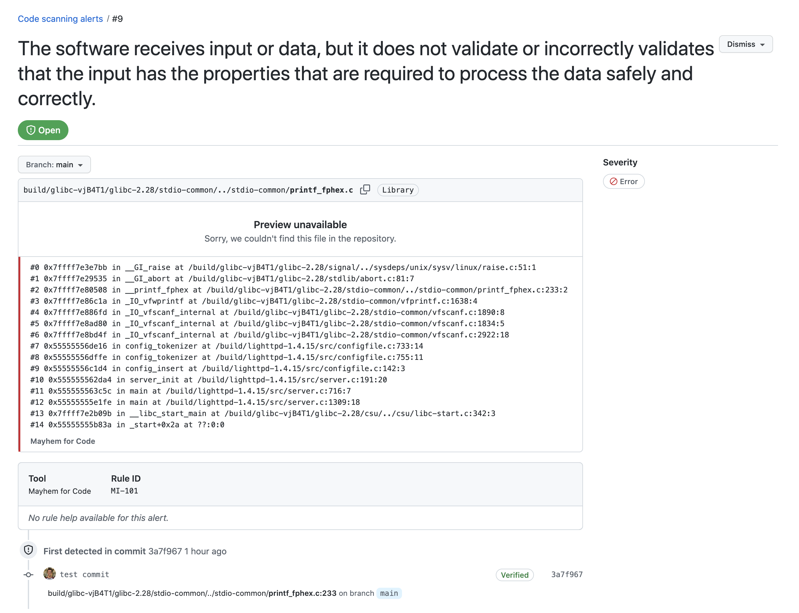

# Mayhem for Code GitHub Action

[](http://mayhem.forallsecure.com/)

A GitHub Action for using Mayhem for Code to check for reliability, performance and security issues in your target binary (packaged as a containerized Docker image).

## About Mayhem for Code

🧪 Modern App Testing: Mayhem for Code is a dynamic testing tool that catches reliability, performance and security bugs before they hit production.

🧑‍💻 For Developers, by developers: The engineers building software are the best equipped to fix bugs, including security bugs. As engineers ourselves, we're building tools that we wish existed to make our job easier!

🤖 Simple to Automate in CI: Tests belong in CI, running on every commit and PRs. We make it easy, and provide results right in your PRs where you want them. Adding Mayhem for Code to a DevOps pipeline is easy.

Want to try it? [Get started for free](https://forallsecure.com/mayhem-free) today!

## Getting Started

To use the Mayhem for Code GitHub Action, you'll need the following pre-requisites:

1. Create a Mayhem account and copy and paste your account token to GitHub Secrets.

    a. Navigate to [mayhem.forallsecure.com](mayhem.forallsecure.com) to register an account.

    b. Click your profile drop-down and go to *Settings* > *API Tokens* to access your account API token.

    c. Copy and paste your Mayhem token to your [GitHub Secrets](https://docs.github.com/en/actions/security-guides/encrypted-secrets#creating-encrypted-secrets-for-an-organization).

2. Create a `mayhem.yml` file in your GitHub repository located at:

    ```sh
    .github/workflows/mayhem.yml
    ```

🤔 Still need some help? Take a look at our working mCode Action examples at: [https://github.com/forallsecure/mcode-action-examples](https://github.com/forallsecure/mcode-action-examples).

## Usage

Your `mayhem.yml` file should look like the following:

```yaml
name: Mayhem
on:
  pull_request:
  workflow_dispatch:

env:
  REGISTRY: ghcr.io
  IMAGE_NAME: ${{ github.repository }}

jobs:
  build:
    name: '${{ matrix.os }} shared=${{ matrix.shared }} ${{ matrix.build_type }}'
    runs-on: ${{ matrix.os }}
    strategy:
      matrix:
        os: [ubuntu-latest]
        shared: [false]
        build_type: [Release]
        include:
          - os: ubuntu-latest
            triplet: x64-linux

    steps:
      - uses: actions/checkout@v2

      - name: Log in to the Container registry
        uses: docker/login-action@f054a8b539a109f9f41c372932f1ae047eff08c9
        with:
          registry: ${{ env.REGISTRY }}
          username: ${{ github.actor }}
          password: ${{ secrets.GITHUB_TOKEN }}

      - name: Extract metadata (tags, labels) for Docker
        id: meta
        uses: docker/metadata-action@98669ae865ea3cffbcbaa878cf57c20bbf1c6c38
        with:
          images: ${{ env.REGISTRY }}/${{ env.IMAGE_NAME }}

      - name: Build and push Docker image
        uses: docker/build-push-action@ad44023a93711e3deb337508980b4b5e9bcdc5dc
        with:
          context: .
          push: true
          tags: ${{ steps.meta.outputs.tags }}
          labels: ${{ steps.meta.outputs.labels }}

      - name: Start analysis
        uses: ethan42/mcode-action@44343bdb4c774508c5b032f1cb24c805ccb5167e
        with:
          mayhem-token: ${{ secrets.MAYHEM_TOKEN }}
          args: --image ${{ steps.meta.outputs.tags }} --corpus file://mayhem/corpus
          sarif-output: sarif


      - name: Upload SARIF file(s)
        uses: github/codeql-action/upload-sarif@v1
        with:
          sarif_file: sarif
```

The mCode GitHUb Action accepts the following inputs:

| Required | Input Name | Type | Description | Default
| --- | --- | --- | --- | ---
| ✔️ | `mayhem-token` | string | Mayhem for Code account token |
|   | `args` | string | Additional arguments such as specifying the corpus directory path |
|   | `sarif-output` | string | Path to the SARIF report output file | 
|   | `sarif_file` | string | Path to the SARIF report input file to be uploaded to GitHub |

# Reports and GitHub Code Scanning

Mayhem for Code generates SARIF reports for your code's security testing results, with the output file generated at the file path according to the `sarif-output` parameter. To upload the SARIF report to GitHub, use the `sarif_file` parameter, respectively, allowing you to view these results in the `Security` tab of your repository as well as your for your individual pull requests.

