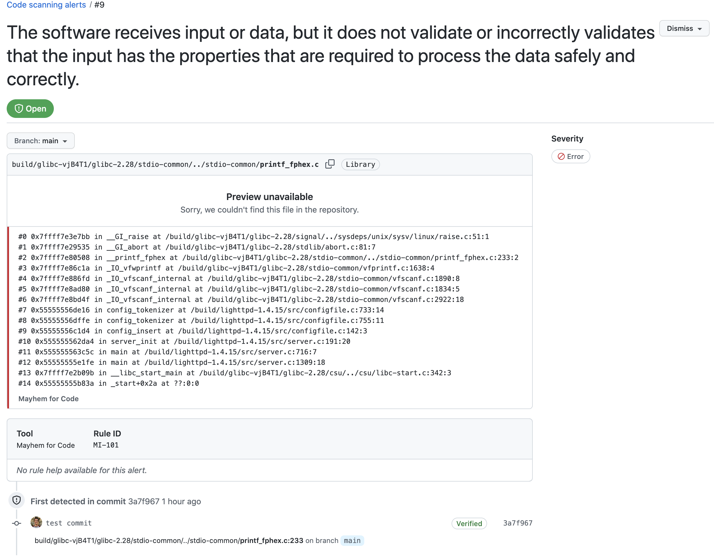

# Mayhem for Code GitHub Action

[](http://app.mayhem.security/)

A GitHub Action for using Mayhem for Code to check for reliability, performance and security issues in your application binary (packaged as a containerized [Docker](https://docs.docker.com/get-started/overview/) image).

## About Mayhem for Code

🧪 Modern App Testing: Mayhem for Code is an application security testing tool that catches reliability, performance and security bugs before they hit production.

🧑‍💻 For Developers, by developers: The engineers building software are the best equipped to fix bugs, including security bugs. As engineers ourselves, we're building tools that we wish existed to make our job easier!

🤖 Simple to Automate in CI: Tests belong in CI, running on every commit and PRs. We make it easy, and provide results right in your PRs where you want them. Adding Mayhem for Code to a DevOps pipeline is easy.

Want to try it? [Get started for free](https://www.mayhem.security/get-started) today!

## Getting Started

To use the Mayhem for Code GitHub Action, perform the following steps:

1. Navigate to [app.mayhem.security](https://app.mayhem.security/) to register an account.

    1. After logging in, on the bottom left:
       1. Click your profile icon.
       2. Click Account Settings.
    2. Switch to *API Tokens* section to access your account API token.

    3. Copy and paste your Mayhem token to your repo's [GitHub Secrets](https://docs.github.com/en/actions/security-guides/encrypted-secrets#creating-encrypted-secrets-for-an-organization). You will need the following secrets configured for your repository:

        * `MAYHEM_TOKEN`: Your Mayhem account API token.

2. Create a `mayhem.yml` file in your GitHub repository located at:

    ```sh
    .github/workflows/mayhem.yml
    ```

🤔 Still need some help? Take a look at our working mCode Action examples at: [https://github.com/forallsecure/mcode-action-examples](https://github.com/forallsecure/mcode-action-examples).

## Usage

Your `mayhem.yml` file should look like the following:

```yaml
name: Mayhem
on:
  push:
    branches: [ main ]
  pull_request:
    branches: [ main ]
  workflow_dispatch:

env:
  REGISTRY: ghcr.io
  IMAGE_NAME: ${{ github.repository }}
  BRANCH_NAME: ${{ github.head_ref || github.ref_name }}

jobs:
  build:
    name: 'build'
    runs-on: ${{ matrix.os }}
    strategy:
      matrix:
        os: [ubuntu-latest]
        shared: [false]
        build_type: [Release]
        include:
          - os: ubuntu-latest
            triplet: x64-linux

    steps:
      - uses: actions/checkout@v3
        with:
          submodules: recursive

      - name: Log in to the Container registry
        uses: docker/login-action@v2.1.0
        with:
          registry: ${{ env.REGISTRY }}
          username: ${{ github.actor }}
          password: ${{ secrets.GITHUB_TOKEN }}

      - name: Extract metadata (tags, labels) for Docker
        id: meta
        uses: docker/metadata-action@v4.1.1
        with:
          images: ${{ env.REGISTRY }}/${{ env.IMAGE_NAME }}

      - name: Set lowercase image name
        run: |
          echo "IMAGE_NAME=${GITHUB_REPOSITORY,,}" >> ${GITHUB_ENV}

      - name: Build and push Docker image
        uses: docker/build-push-action@v3.2.0
        with:
          context: .
          push: true
          file: Dockerfile
          tags: ${{ env.REGISTRY }}/${{ env.IMAGE_NAME }}:${{ env.BRANCH_NAME }}
          labels: ${{ steps.meta.outputs.labels }}

    outputs:
      image: ${{ env.REGISTRY }}/${{ env.IMAGE_NAME }}:${{ env.BRANCH_NAME }}

  mayhem:
    needs: build
    name: 'fuzz'
    runs-on: ubuntu-latest
    strategy:
      fail-fast: false
      matrix:
        mayhemfile:
          - mayhem/Mayhemfile.lighttpd
          - mayhem/Mayhemfile.mayhemit
          # Specify one or many Mayhemfiles here

    steps:
      - uses: actions/checkout@v3

      - name: Start analysis for ${{ matrix.mayhemfile }}
        uses: ForAllSecure/mcode-action@v1
        with:
          mayhem-url: ${{ secrets.MAYHEM_URL }}
          mayhem-token: ${{ secrets.MAYHEM_TOKEN }}
          args: --image ${{ needs.build.outputs.image }} --file ${{ matrix.mayhemfile }} --duration 300
          sarif-output: sarif
          junit-output: junit
          coverage-output: coverage

      - name: Upload SARIF file(s)
        uses: github/codeql-action/upload-sarif@v2
        with:
          sarif_file: sarif

      - name: Archive Coverage report
        uses: actions/upload-artifact@v3
        with:
          name: coverage-report
          path: coverage

      - name: Archive JUnit results
        uses: actions/upload-artifact@v3
        with:
          name: mcode-junit
          path: junit

      - name: Upload SARIF file(s)
        uses: github/codeql-action/upload-sarif@v2
        with:
          sarif_file: sarif
```

The mCode Action accepts the following inputs:

| Required | Input Name | Type | Description | Default
| --- | --- | --- | --- | ---
|   | `mayhem-url` | string | Path to a custom Mayhem for Code instance. | https://app.mayhem.security |
|   | `mayhem-token` | string | Mayhem for Code account token. **Only required within** `mayhem.yml` **if overriding** `mayhem-url`. |
|   | `args` | string | Additional CLI override [arguments](https://app.mayhem.security/docs/code-testing/reference/mayhem-cli-commands/#run) such as specifying the `--testsuite` directory path for a seed test suite. |
|   | `sarif-output` | string | Path for generating a SARIF report output file. |
|   | `junit-output` | string | Path for generating a jUnit report output file. |
|   | `coverage-output` | string | Path for generating a coverage report output files. |
|   | `owner` | string | The workspace for the run. |
|   | `project` | string | The name of the project  |  Defaults to the name of your repository if not defined. |

The mCode Action provides the following outputs:
| Output Name | Type | Description | Default
| --- | --- | --- | ---
| `runId` | string | The identifier of the run that this action triggered in Mayhem. |


📖 See the [GitHub Action Integration](https://app.mayhem.security/docs/integrations/ci-integrations/github/) docs for more information and guides on using the mCode GitHub Action!

## Reports and GitHub Code Scanning

Mayhem for Code generates [SARIF reports](https://sarifweb.azurewebsites.net/#:~:text=The%20Static%20Analysis%20Results%20Interchange,approved%20as%20an%20OASIS%20standard.) for your application security testing results.

SARIF reports are generated using the `sarif-output` parameter, which specifies an output file path.

To upload the SARIF report to GitHub, see the `Upload SARIF file(s)` step in the `mayhem.yml` example above.

Once uploaded to GitHub, you can view test results in the `Security` tab of your repository as well as for your individual pull requests.



## How to Contribute

Fork this repository and modify the [`main.ts`](src/main.ts) file. Then, re-compile the mCode GitHub Action by executing the following commands at the root of your forked repository:

```sh
make dist-rebuild
```

Finally, push your changes and submit a pull request from your forked repository to this repository and we'll review!

## About Us

ForAllSecure was founded with the mission to make the world’s critical software safe. The company has been applying its patented technology from over a decade of CMU research to solving the difficult challenge of making software safer. ForAllSecure has partnered with Fortune 1000 companies in aerospace, automotive and high-tech industries, as well as the US Department of Defense to integrate Mayhem into software development cycles for continuous security. Profitable and revenue-funded, the company is scaling rapidly.

* [https://mayhem.security/](https://mayhem.security/)
* [https://www.mayhem.security/code-security](https://www.mayhem.security/code-security)
* [https://community.forallsecure.com/](https://community.forallsecure.com/)
